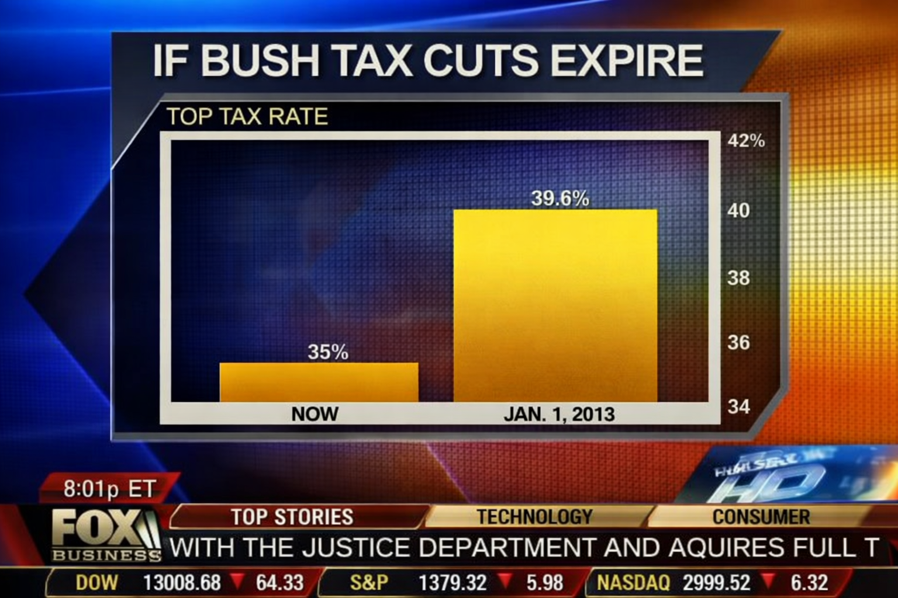

```{r setup, include=FALSE}
# Bibliotheken laden
library(ggplot2)
library(tidyverse)


# Globales Design für alle Plots setzen (Clean & Professional)
theme_set(theme_minimal(base_size = 14) +
          theme(panel.grid.minor = element_blank(),
                plot.title = element_text(face = "bold"),
                strip.text = element_text(face = "bold")))


highlight_color <- "#00802F"

```


## A Familiar Sight

::: {.columns}

::: {.column width="70%"}
{width="100%"}
:::

::: {.column width="30%"}
::: {.fragment}
### 
We encounter charts like this every day in professional reports.
:::

::: {.fragment}
**But look closer...**
What exactly is wrong?
::: 
:::

:::

## Outline of the presentation
* Bullet point


## Slide 3
* bullet point

## slide 4


