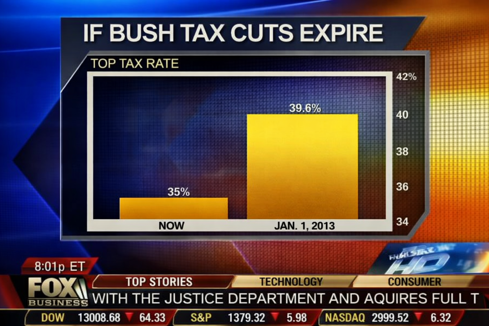
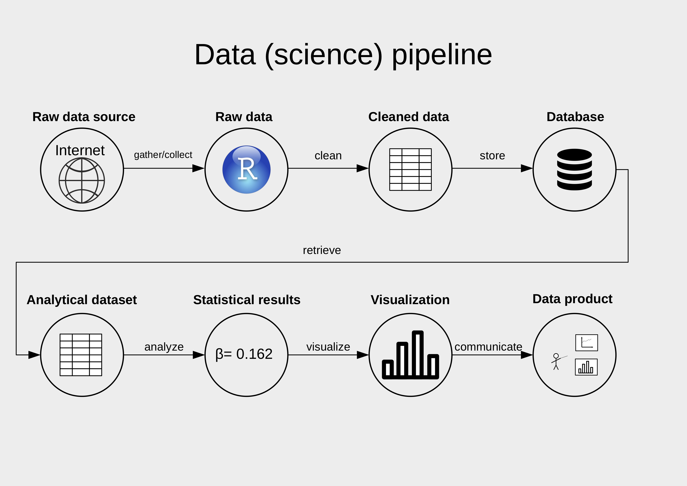
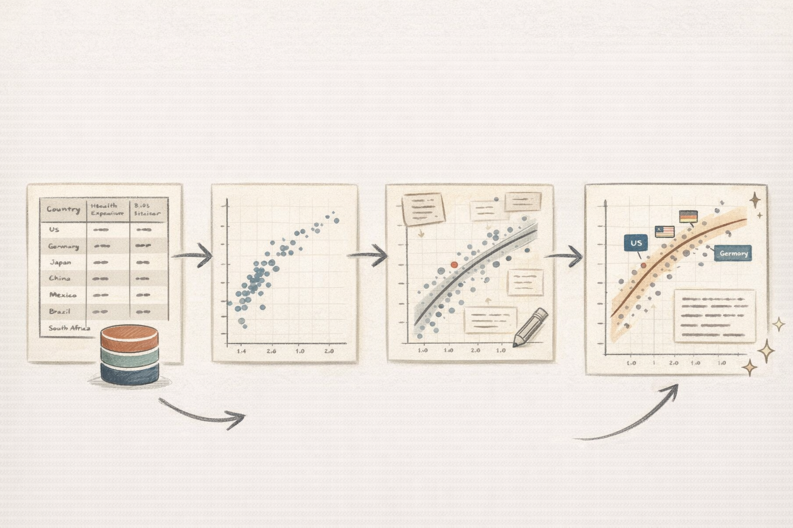
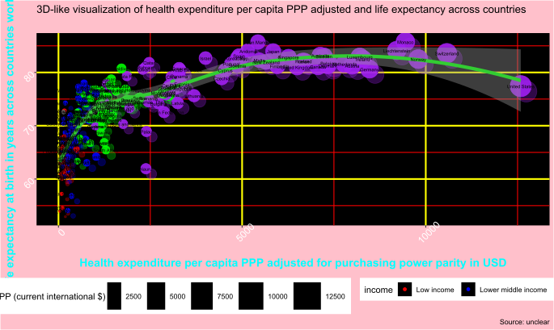
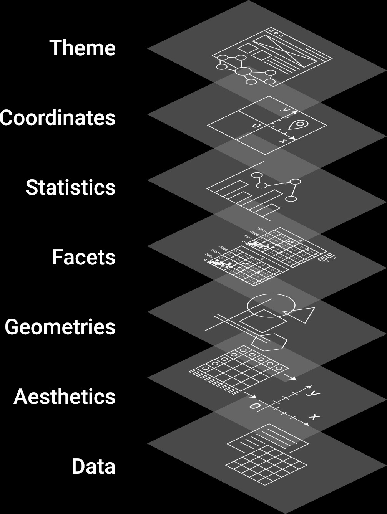

```{r setup, include=FALSE}

library(ggplot2)
library(tidyverse)
library(ggrepel)
library(dplyr)
library(knitr)


# Globales Design für alle Plots setzen (Clean & Professional)
theme_set(theme_minimal(base_size = 14) +
          theme(panel.grid.minor = element_blank(),
                plot.title = element_text(face = "bold"),
                strip.text = element_text(face = "bold")))


highlight_color <- "#00802F"
```
```{r, echo=FALSE}
df_final <- readRDS("df_final.rds")

```

## A Familiar Sight

::::::: columns
::: {.column width="49%"}
{width="100%"}
:::

::: {.column width="35%"}
{width="100%" fig-align="center"}
:::

::: fragment
### 

We encounter charts like those every day.
:::

::: fragment
**But look closer...** What exactly is wrong?
:::
:::::::

## Outline of the presentation

:::: {.columns}

::: {.column width="50%"}
- Why data science in economics?
- Context of the Data handling project

- Data visualization
  - Goal
  - What to avoid
  - Tools and principles
  - Application on health economics
- Summary and key learnings
:::

::: {.column width="50%"}
{fig-align="center"}
:::

::::


## Why data science in economics?

:::: {.columns}

::: {.column width = "50%"}

{width="100%"}
:::

:::{.column width = "50%"}

- Loads of economic data
- Use tools to explore data → R!
- Make explorations in huge datasets
- Create regressions for causal inference
- Use ML to make predictions
- Tell a story with data

→ Here visualization plays a big role!

:::

::::

## Context of the Data Handling project

:::::: columns
::: {.column width="60%"}
{width="100%"}
:::

::: {.column width="36%"}

-   **Target Group**: Introduction course for economics students (3rd semester).
-   **Motivation**: Relevance of data science skills in today’s world.
:::
::::::

## The path to clear visualization

- We want to visualize the relationship between **health expenditure per capita (PPP)** and **life expectancy at Birth** in 2022. 

::: {.columns}

::: {.column width="55%"}
::: {.incremental}
- A correct plot is not enough → it must be clear and interpretable
- So how do we move from raw data to meaningful insight?
:::
:::

::: {.column width="45%"}
{width="100%"}
:::

:::
## We want to avoid this



## Or this
```{r}
#| echo: false
#| warning: false
#| message: false

library(ggplot2)
library(dplyr)
library(tidyr) # Wichtig: Wird gebraucht, um die Spalten umzuwandeln

df_final %>%
  # Nur die Schweiz und z.B. 2012 bis 2022 filtern
  filter(country_name == "Switzerland" & year >= 2012 & year <= 2022) %>%
  
  # MAGIE: Wir nehmen alle Spalten, die mit "ind_" anfangen, und machen sie zu Kuchenstücken
  pivot_longer(
    cols = starts_with("ind_"), 
    names_to = "Indicator", 
    values_to = "Value"
  ) %>%
  
  # Jetzt bauen wir den Kuchen: X ist leer, Y ist der Wert, die Farbe ist der Indikator
  ggplot(aes(x = "", y = Value, fill = Indicator)) +
  geom_bar(stat = "identity", width = 1, color = "white") +
  coord_polar("y", start = 0) +
  
  # Für jedes Jahr einen eigenen Kuchen
  facet_wrap(~ year, ncol = 4) +
  
  # Blendet die unsinnigen Achsen aus
  theme_void() +
  
  # Englische Beschriftungen
  labs(
    title = "Switzerland: Health Indicators by Year",
    subtitle = "A catastrophic chart summing completely unrelated units.",
    fill = "Indicator"
  ) +
  
  # Das Design
  theme(
    plot.title = element_text(face = "bold", size = 16),
    plot.subtitle = element_text(size = 12, margin = margin(b = 10)),
    legend.position = "bottom",
    legend.text = element_text(size = 8),
    legend.direction = "vertical" # Stapelt die Legende hässlich übereinander
  )
```

## Data visualization - layers

:::::: columns
::: {.column width="45%"}
{width="100%"}
:::

:::: {.column width="55%" style="font-size: 0.75em; padding-left: 20px;"}
::: incremental
-   **Data**: Start with your raw data (e.g., World Bank RDS).
-   **Aesthetics**: Map variables to axes, colors, and sizes.
-   **Geometries**: Choose shapes (points, bars, lines).
-   **Facets**: Split data into subplots (e.g., by region).
-   **Statistics**: Add models like regression lines.
-   **Coordinates**: Adjust the coordinate system or zoom.
-   **Theme**: Final styling (fonts, colors, HSG branding).
:::
::::
::::::


------------------------------------------------------------------------

## Step 1.1 — Data
```{r}
head(df_final)
tail(df_final)
```

## Step 1.2 - Filtering data for 2022
```{r, echo=TRUE}
#| code-fold: true
#| code-summary: "Show R Code"
set.seed(42)
df_final %>%
  filter(year == 2022) %>%
  select(Country = country_name, Income = income, `Health PPP` = ind_WorldBank_health_pp, `Life Exp.` = ind_WorldBank_lifeexpectancy) %>%
  mutate(`Health PPP` = round(`Health PPP`, 0), `Life Exp.` = round(`Life Exp.`, 1)) %>%
  slice_sample(n = 10) %>% 
  kable()
```


## Step 2.1 - Aesthetics
```{r}
#| echo: false
df_final %>%
  filter(year == 2022) %>%
  ggplot(aes(x = ind_WorldBank_health_usd, y = ind_WorldBank_lifeexpectancy)) +
  geom_point()+ labs(x = NULL, y = NULL)
```

-   Position on axes is the most effective encoding
-   Scatterplot is appropriate for two continuous variables

At this stage:

-   The chart is technically correct\
-   But it does not yet communicate a clear message

------------------------------------------------------------------------

## Step 2.2 — Aesthetics
```{r}
#| echo: false
#| warning: false
df_final %>%
  filter(year == 2022) %>%
  ggplot(aes(x = ind_WorldBank_health_usd, y = ind_WorldBank_lifeexpectancy)) +
  geom_point()+
  theme_classic() +
  labs(title = "Life Expectancy vs. Health Expenditure per Capita (2022)",
       x = "Health expenditure per capita (PPP)",
       y = "Life Expectancy at Birth (years)") +
  theme(panel.grid.major.y = element_line(color = "grey90", linewidth = 0.3))  
```

-   Axes must be clearly labeled
-   We add axis labels and a title\
-   The reader now understands what is shown
-   But no clear understanding of data points

------------------------------------------------------------------------

## Step 3.1 - Geometries

```{r}
#| echo: false
#| warning: false

df_final %>%
  filter(year == 2022) %>%
  ggplot(aes(x = ind_WorldBank_health_pp, y = ind_WorldBank_lifeexpectancy)) +
  
  # --- EBENE 3: GEOMETRIES ---
  # Nur die Punkte! Die Transparenz (alpha) hilft uns bei Überlappungen.
  geom_point(alpha = 0.6, color = "black", size = 2) +
  
  theme_classic() +
  labs(title = "Life Expectancy vs. Health Expenditure per Capita (2022)",
       x = "Health expenditure per capita (PPP)",
       y = "Life Expectancy at Birth (years)")+
  theme(panel.grid.major.y = element_line(color = "grey90", linewidth = 0.3))
```
- Reduce opacity of data points to show the concentration 

## Step 3.2 - Variation → Show income groups
```{r}
#| echo: false
#| warning: false

df_final %>%
  filter(year == 2022) %>%
  ggplot(aes(x = ind_WorldBank_health_pp, 
             y = ind_WorldBank_lifeexpectancy, 
             shape = income,
             color = income)) + 
  
  # --- EBENE 3: GEOMETRIES ---
  geom_point(alpha = 0.6, size = 2) +
  
  theme_classic() +
  labs(title = "Life Expectancy vs. Health Expenditure (2022)",
       subtitle = "Colored and Shaped by Income Group",
       x = "Health expenditure per capita (PPP)",
       y = "Life Expectancy at Birth (years)",
       color = "Income Group",   # Titel für die Farbe
       shape = "Income Group") + # EXAKT DERSELBE Titel für die Form
  theme(panel.grid.major.y = element_line(color = "grey90", linewidth = 0.3))
```


------------------------------------------------------------------------

## Step 4 - Facets
```{r}
#| echo: false
#| warning: false
#| message: false

df_final %>%
  # Wir filtern jetzt auf drei Jahre, um sie vergleichen zu können
  filter(year %in% c(2020, 2021, 2022)) %>%
  ggplot(aes(x = ind_WorldBank_health_pp, y = ind_WorldBank_lifeexpectancy)) +
  
  # Geometries & Statistics aus dem vorherigen Schritt
  geom_point(alpha = 0.6, color = "black", size = 1.5)+
  
  # --- EBENE 5: FACETS ---
  # Teilt den Plot basierend auf dem Jahr in mehrere kleine Plots auf
  facet_wrap(~ year) +
  
  # Das bekannte saubere Theme
  theme_classic() +
  labs(title = "Life Expectancy vs. Health Expenditure per Capita (2022)",
       x = "Health expenditure per capita (PPP)",
       y = "Life Expectancy at Birth (years)") +
  theme(
    strip.text = element_text(face = "bold", size = 12),
    panel.grid.major.y = element_line(color = "grey90", linewidth = 0.3)
  )
```

- Doesn't make sense in our case to see a snapshot in time. 
- We go back to one single chart :-)

------------------------------------------------------------------------

## Step 5 — Statistics

```{r}
#| echo: false
#| warning: false
#| message: false


df_final %>%
  filter(year == 2022) %>%
  ggplot(aes(x = ind_WorldBank_health_pp, y = ind_WorldBank_lifeexpectancy)) +
  geom_point(alpha = 0.6, color = "#3288bd") + 
  
  # --- ANGEPASSTE TRENDLINIE ---
  geom_smooth(method = "loess", se = FALSE, color = "grey50", linetype = "dashed") +  
  
  theme_classic() +
  labs(title = "Life Expectancy vs. Health Expenditure per Capita (2022)",
       x = "Health expenditure per capita (PPP)",
       y = "Life Expectancy at Birth (years)")+
  theme(axis.title = element_text(size = 12),
    axis.text = element_text(size = 10),
    panel.grid.major.y = element_line(color = "grey90", linewidth = 0.3))
```

-   Help the audience see patterns, not just data points
-   Adding a trend line reveals the relationship
-   We begin to see diminishing returns

------------------------------------------------------------------------

## Step 6 — Coordinates

```{r}
#| echo: false
#| warning: false
#| message: false

df_final %>%
  filter(year == 2022) %>%
  ggplot(aes(x = ind_WorldBank_health_pp, y = ind_WorldBank_lifeexpectancy)) +
  
  # --- EBENE 3 & 4: GEOMETRIES & STATISTICS ---
  # Die Punkte im exakten Blau des finalen Plots
  geom_point(alpha = 0.8, color = "#3288bd", size = 2) + 
  geom_smooth(method = "loess", se = FALSE, color = "grey50", linetype = "dashed") +
  
  # --- EBENE 5: COORDINATES ---
  # Zwingt die Achsen exakt in den Bereich des Screenshots
  scale_x_continuous(
    limits = c(0, 13000),             # Plot-Bereich von 0 bis 13.000
    breaks = seq(0, 12000, 4000)      # Striche bei 0, 4000, 8000, 12000
  ) +
  scale_y_continuous(
    limits = c(0, 105),               # Plot-Bereich von 0 bis 105
    breaks = seq(0, 100, 25)          # Striche bei 0, 25, 50, 75, 100
  ) +
  
  # Das saubere Theme (weißer Hintergrund)
  theme_classic() +
  labs(title = "Life Expectancy vs. Health Expenditure per Capita (2022)",
       x = "Health expenditure per capita (PPP)",
       y = "Life Expectancy at Birth (years)") +
  theme(
    axis.title = element_text(size = 12),
    axis.text = element_text(size = 10),
    panel.grid.major.y = element_line(color = "grey90", linewidth = 0.3)
  )
```

- Shift the data points more to the center of the diagram
- Improves readability

------------------------------------------------------------------------

## Step 7 — Theme
```{r}
#| echo: false
#| warning: false
#| message: false

df_final |>
  filter(year == 2022) |>
  filter(country_name != "Central African Republic") |> # remove outlier with very low spending and life expectancy
  select(
    income,
    country,
    country_name,
    ind_WorldBank_health_usd,
    ind_WorldBank_health_pp,
    ind_WorldBank_lifeexpectancy
  ) |>
  mutate(
    label = if_else(
      (ind_WorldBank_health_usd >
         quantile(ind_WorldBank_health_usd, 0.9, na.rm = T) |
         ind_WorldBank_health_usd <
         quantile(ind_WorldBank_health_usd, 0.1, na.rm = T) |
         ind_WorldBank_health_pp >
         quantile(ind_WorldBank_health_pp, 0.9, na.rm = T) |
         ind_WorldBank_health_pp <
         quantile(ind_WorldBank_health_pp, 0.1, na.rm = T) |
         ind_WorldBank_lifeexpectancy <
         quantile(ind_WorldBank_lifeexpectancy, 0.1, na.rm = T) |
         ind_WorldBank_lifeexpectancy >
         quantile(ind_WorldBank_lifeexpectancy, 0.9, na.rm = T)) &
        income %in% c("High income") &
        country_name %in% c(
          "Germany", "Finland", "Sweden", "Norway", "Italy", "Spain", "Portugal", "United Kingdom",
          "Ireland", "Netherlands", "Poland", "Austria", "Belgium", "Denmark", "France",
          "Greece", "Czech Republic", "Slovak Republic", "Hungary", "Luxembourg", "Iceland"
        ),
      country_name,
      NA_character_
    )
  ) |>
  ggplot(aes(
    y = ind_WorldBank_lifeexpectancy,
    x = ind_WorldBank_health_pp
  )) +
  geom_smooth(
    method = "loess",
    se = FALSE,
    color = "grey50",
    linetype = "dashed",
    linewidth = 0.5
  ) +
  geom_point(alpha = 0.75, color = "#0072B2", size = 1.5) +
  scale_y_continuous(limits = c(0, 100)) +
  # Label outliers but exclude US and Switzerland (they are highlighted separately)
  geom_text_repel(
    data = . %>%
      filter(
        !is.na(label) & !(country_name %in% c("United States", "Switzerland"))
      ),
    aes(label = label),
    size = 3,
    color = "black",
    segment.color = "grey80",
    box.padding = 0.4,
    max.overlaps = 20
  ) +
  # Highlight US and Switzerland with red points
  geom_point(
    data = df_final %>%
      filter(
        year == 2022 & country_name %in% c("United States", "Switzerland")
      ),
    aes(x = ind_WorldBank_health_pp, y = ind_WorldBank_lifeexpectancy),
    color = "#D55E00",
    size = 3.3
  ) +
  # Highlight countries that illustrate the threshold effect
  geom_text_repel(
    data = df_final %>%
      filter(year == 2022, country_name %in% c("United States", "Switzerland")),
    aes(
      x = ind_WorldBank_health_pp,
      y = ind_WorldBank_lifeexpectancy,
      label = country_name
    ),
    color = "#D55E00",
    size = 3.8,
    fontface = "bold",
    box.padding = 0.65,
    direction = "y",
    max.overlaps = 20,
    segment.color = "grey50",
    show.legend = FALSE
  ) +
  labs(
    title = "Twice the spending, same or lower life expectancy",
    subtitle = "US and Switzerland spend about twice as much on health (PPP per capita, 2022) as \nother OECD countries with similar life expectancy",
    x = "Health expenditure per capita (PPP)",
    y = "Life Expectancy at Birth (years)",
    caption = "Spending shown in PPP per capita (purchasing power parity: adjusted for price-level differences). \nSource: World Bank, 2022."
  ) +
  theme_classic() +
  theme(
    plot.title = element_text(size = 14, face = "bold"),
    plot.subtitle = element_text(size = 11, color = "grey30"),
    panel.grid.major.y = element_line(color = "grey90", linewidth = 0.3),
    plot.margin = margin(5.5, 5.5, 5.5, 5.5)
  )

```

-   Not all data points are equally important: Use visual hierarchy to guide attention
-   Extensive description added to make the diagram self explanatory


------------------------------------------------------------------------


## Further Project Visualizations - 1
```{r}
#| echo: false
#| warning: false
#| message: false
data_income_groups <- readRDS("data_income_groups.rds")
# Wir brauchen zwei kleine Hilfs-Datensätze für die Beschriftungen am Anfang (2000) und am Ende (2022)
data_2000 <- data_income_groups |> filter(year == 2000)
data_2022 <- data_income_groups |> filter(year == 2022)

# Wir definieren die Farben, die im Bild verwendet wurden (ungefähr)
custom_colors <- c("High income" = "#DE4A8D", 
                   "Upper middle income" = "#7976B8", 
                   "Lower middle income" = "#CC6B32", 
                   "Low income" = "#4B9B79")

# --- Der Plot ---
data_income_groups |>
  ggplot(aes(x = year, y = ind_WorldBank_health_ppp_mean, color = income)) +
  geom_line(linewidth = 1.2) +
  
  # 1. Beschriftungen auf der LINKEN Seite (Werte für das Jahr 2000)
  geom_text(data = data_2000, 
            aes(label = round(ind_WorldBank_health_ppp_mean)), 
            hjust = 1.3,      # Schiebt den Text leicht nach links neben den Startpunkt
            fontface = "bold", 
            size = 2.2) +
  
  # 2. Beschriftungen auf der RECHTEN Seite (Name + Jahr: Wert für 2022)
  geom_text(data = data_2022, 
            # \n macht einen Zeilenumbruch im Text
            aes(label = paste0(income, "\n2022: ", round(ind_WorldBank_health_ppp_mean))), 
            hjust = -0.1,     # Schiebt den Text leicht nach rechts neben den Endpunkt
            fontface = "bold",
            lineheight = 0.9, # Verringert den Zeilenabstand im Label
            size = 2.2) +
  
  # 3. Eigene Farben anwenden
  scale_color_manual(values = custom_colors) +
  
  # 4. Achsen anpassen (X-Achse verlängern, damit der Text rechts Platz hat!)
  scale_x_continuous(limits = c(1998, 2026), breaks = seq(2000, 2020, by = 5)) +
  scale_y_continuous(limits = c(0, NA)) + # Zwingt die Y-Achse, bei 0 zu starten
  
  # 5. Titel und Achsenbeschriftungen
  labs(
    title = "High-income countries spend much more per person on health than others.",
    subtitle = "Income groups diverge in health spending: trends 2000-2022",
    x = "Year (2000-2022)",
    y = "Health Expenditure per Capita (PPP)",
    caption = "Source: World Bank"
  ) +
  
  # 6. Das Design (Theme) feintunen
  theme_classic() +
  theme(
    legend.position = "none", # Legende komplett entfernen (wir haben ja jetzt Direct Labeling)
    
    # Horizontale graue Hilfslinien hinzufügen (theme_classic hat standardmäßig keine)
    panel.grid.major.y = element_line(color = "grey90", linewidth = 0.5), 
    
    # Titel-Formatierung
    plot.title = element_text(face = "bold", size = 16, margin = margin(b = 8)),
    plot.subtitle = element_text(color = "grey50", size = 13, margin = margin(b = 15)),
    
    # Textgrößen für die Achsen
    axis.text = element_text(size = 11, color = "black"),
    axis.title = element_text(size = 12),
    
    # Platz um den Plot herum schaffen (oben, rechts, unten, links), damit nichts abgeschnitten wird
    plot.margin = margin(t = 20, r = 40, b = 20, l = 20) 
  )
```


## Further Project Visualizations - 2
```{r}
#| echo: false
#| warning: false
#| message: false
df_oecd_status <- df_final |>
  filter(!is.na(health_status_oecd)) |>
  filter(year >= 2005 & year <= 2022) |>
  group_by(year) |>
  summarise(
    avg_health_status = mean(health_status_oecd, na.rm = TRUE),
    .groups = "drop"
  )

ggplot(df_oecd_status, aes(x = year, y = avg_health_status)) +
  geom_line(size = 1.2, color = "#0072B2") +
  scale_y_continuous(labels = scales::percent_format(accuracy = 1, scale = 1), lim = c(60, 75)) +
  labs(
    subtitle = "Average perceived health status (OECD): 2005–2022",
    title = "The share of respondents reporting 'good/very good' health \nin high income countries increased slowly in the past 20 years.",
    x = "Year",
    y = "Share reporting good/very good health",
    caption = "Source: OECD"
  ) +
  theme_classic() +
  theme(
    legend.position = "none",
    plot.title = element_text(size = 14, face = "bold"),
    plot.subtitle = element_text(size = 11, color = "grey30"),
    panel.grid.major.y = element_line(color = "grey90", linewidth = 0.3),
    plot.margin = margin(5.5, 5.5, 5.5, 5.5)
  )

```


## Summary and key learnings

:::: {.columns}

:::{.column width = "50%"}

{width="100%"}
:::

::: {.column width = "50%"}
-   Frist hands-on approach to data science
-   Importance of data visualization in economics
-   Clear workflow on how to visualize economic data
-   What to avoid when creating graphs and diagrams
-   Application of these skills in other courses and improved ability to critically interpret visualizations
:::

::::