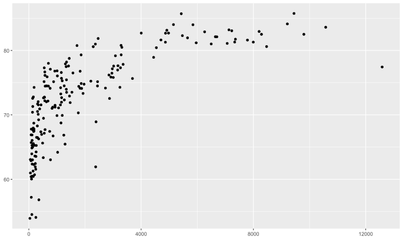
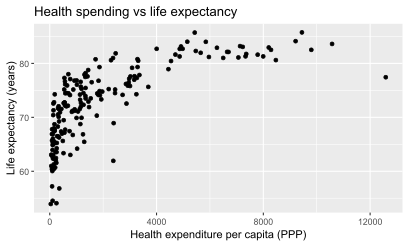
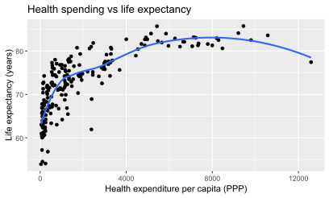
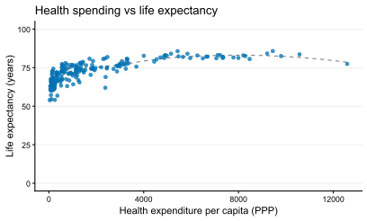
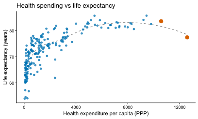
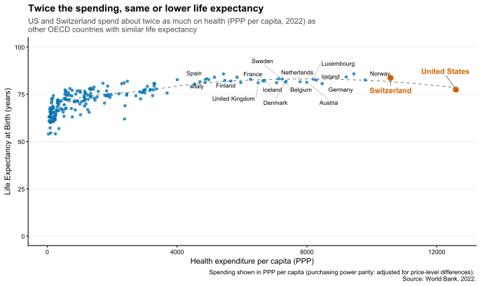
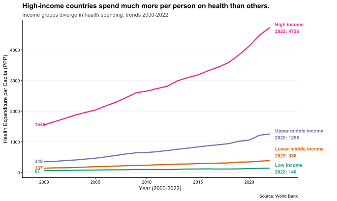
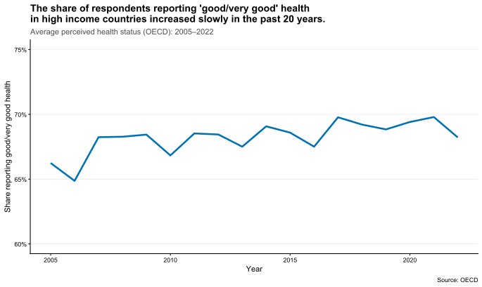

```{r setup, include=FALSE}
# Bibliotheken laden
library(ggplot2)
library(tidyverse)


# Globales Design für alle Plots setzen (Clean & Professional)
theme_set(theme_minimal(base_size = 14) +
          theme(panel.grid.minor = element_blank(),
                plot.title = element_text(face = "bold"),
                strip.text = element_text(face = "bold")))


highlight_color <- "#00802F"

```


## A Familiar Sight

::: {.columns}

::: {.column width="70%"}
{width="100%"}
:::

::: {.column width="30%"}
::: {.fragment}
### 
We encounter charts like this every day in professional reports.
:::

::: {.fragment}
**But look closer...**
What exactly is wrong?
::: 
:::

:::

## Outline of the presentation

- Context of the Data handling project  
- Data visualization  
  - Tools, principles and application  
- Summary and key learnings 


## Context of the Data handling project  

- Introduction to programming for economics students (3rd semester)  
- Relevance of data science skills in today’s world  
- Data pipeline basics: importing, cleaning, transforming, visualizing 

  {width="50%"}
  
  


## Data visualization - Tools
<span style="color:#7f8c8d;">ggplot2</span>

- **Layers** (build plots step by step)  
- **Geoms** (visual representation: points, lines, bars)  
- **Aesthetics** (mapping data to visual properties)  
- **Facets** (split data into subplots)  

## Data visualization - Tools
<span style="color:#7f8c8d;">gtExtras</span>

- Extension to the gt package for enhanced tables  
- Adds visual elements (bars, icons, color scales)  
- Makes tables more informative and easier to read  


## From Raw Data to Insight: Building a Clear Visualization

- We want to visualize the relationship between health expenditure and life expectancy  

- A correct plot is not enough → it must be clear and interpretable  

- So how do we move from raw data to meaningful insight?  

## Clear principles to avoid this


---

## Step 1 — Raw encoding




- Position on axes is the most effective encoding
- Scatterplot is appropriate for two continuous variables

At this stage:

- The chart is technically correct  
- But it does not yet communicate a clear message  

---

## Step 2 — Add clarity and context




- Axes must be clearly labeled
- A plot should be understandable without external explanation

Improvement:

- We add axis labels and a title  
- The reader now understands what is shown  

---

## Step 3 — Reveal structure




- Help the audience see patterns, not just data points

Improvement:

- Adding a trend line reveals the relationship  
- We begin to see diminishing returns  

---

## Step 4 — Reduce visual noise



- Avoid unnecessary visual elements: Maximize data-to-ink ratio  


Improvement:

- Focus shifts to the data (through cleaner theme and subtle colors)

---

## Step 5 — Create focus




- Not all data points are equally important: Use visual hierarchy to guide attention 

Improvement:

- Key countries (US, Switzerland) are highlighted  
- The narrative begins to emerge  

---

## Step 6 — Tell the story




- A good graph tells a complete story  
- It should be interpretable without explanation  

Improvement:

- Selective labeling of relevant countries  
- Strong, message-driven title  

## Further Project Visualizations - 1 



## Further Project Visualizations - 2



## Summary and key learnings 

- Importance of data visualization combined with a structured data workflow  
- Application of these skills in other courses and improved ability to critically interpret visualizations


