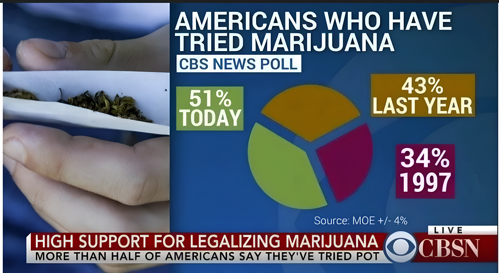

```{r setup, include=FALSE}

library(ggplot2)
library(tidyverse)
library(ggrepel)
library(dplyr)
library(knitr)


# Globales Design für alle Plots setzen (Clean & Professional)
theme_set(theme_minimal(base_size = 14) +
          theme(panel.grid.minor = element_blank(),
                plot.title = element_text(face = "bold"),
                strip.text = element_text(face = "bold")))


highlight_color <- "#00802F"
```
```{r, echo=FALSE}
df_final <- readRDS("df_final.rds")

df_final <- df_final %>%
  filter(ind_WorldBank_lifeexpectancy >= 20)

```


## Quote {background-color="#f8f9fa"}

```{=html}
<style>
/* Container für das gesamte Zitat auf der Folie */
.quote-container {
  max-width: 85%;
  margin: 80px auto;
  text-align: left;
}

/* Styling des eigentlichen Zitat-Textes */
.elegant-quote {
  font-size: 1.45em;          /* Angenehme, gut lesbare Größe */
  line-height: 1.5;           /* Mehr Zeilenabstand für leichtere Lesbarkeit */
  color: #1a252f;             /* Hochkontrastierendes Dunkelgrau statt hartem Schwarz */
  font-style: italic;         /* Klassischer Zitatstil */
  font-weight: 400;
  position: relative;
  padding-left: 35px;
  border-left: 5px solid #00802F; /* Eleganter grüner Balken (passend zu deinem HSG/Muster-Design) */
}

/* Große, dezente Anführungszeichen im Hintergrund */
.elegant-quote::before {
  content: "“";
  font-size: 4em;
  position: absolute;
  left: -15px;
  top: -45px;
  color: rgba(0, 128, 47, 0.15); /* Sehr transparentes Grün */
  font-family: "Georgia", serif;
}

/* Styling für den Autor */
.quote-author {
  display: block;
  margin-top: 30px;
  padding-left: 35px;
  font-size: 0.85em;
  color: #7f8c8d;             /* Dezentes Grau für den Urheber */
  font-weight: 600;
  letter-spacing: 1.5px;      /* Leicht gesperrter Text für modernen Look */
  text-transform: uppercase;  /* Autor in feinen Großbuchstaben */
}
</style>
```

::: {.quote-container}
::: {.elegant-quote}
"Most of us need to listen to the music to understand how beautiful it is. But often that’s how we present statistics: we just show the notes, we don’t play the music."
:::
[— Hans Rosling]{.quote-author}
:::

## What is wrong with these graphs?

:::: {.columns}

::: {.column width="50%"}
{fig-align="center" width="90%"}
:::

::: {.column width="50%"}
{fig-align="center" width="110%"}
:::

::::


## Outline of the presentation

:::: {.columns}

::: {.column width="50%"}

- Personal introduction

- Data pipeline

- Data visualization
  - Research question
  - Building the chart step by step
  - Key insights & further examples
  
- Q&A

:::

::: {.column width="50%"}
{fig-align="center"}
:::

::::

## Jonas Weber

<div style="
  display: grid;
  grid-template-columns: 1fr 1fr;
  grid-template-rows: 250px 250px;
  gap: 0;
  width: 100%;
  margin-top: -10px;
">

  <div style="
    background-image: url('images/Jonas-intro1.png');
    background-size: cover;
    background-position: center;
    width: 100%;
    height: 100%;
    overflow: hidden;
  "></div>

  <div style="
    background-image: url('images/Jonas-intro3.png');
    background-size: cover;
    background-position: center;
    width: 100%;
    height: 100%;
    overflow: hidden;
  "></div>

  <div style="
    background-image: url('images/military.png');
    background-size: cover;
    background-position: center;
    width: 100%;
    height: 100%;
    overflow: hidden;
  "></div>

  <div style="
    background-image: url('images/Jonas-intro2.png');
    background-size: cover;
    background-position: center;
    width: 100%;
    height: 100%;
    overflow: hidden;
  "></div>

</div>


## Yann Rochaix

<div style="display: grid; grid-template-columns: 1fr 1fr; grid-template-rows: 250px 250px; gap: 0; width: 100%; margin-top: -10px;">
  
  <div style="background-image: url('images/Yann-intro1.png'); background-size: cover; background-position: center; width: 100%; height: 100%;"></div>
  
  <div style="background-image: url('images/Yann-intro3.jpeg'); background-size: cover; background-position: center; width: 100%; height: 100%;"></div>
  
  <div style="background-image: url('images/Yann-intro2.png'); background-size: cover; background-position: 50% 50%; width: 100%; height: 100%;"></div>
  
  <div style="background-image: url('images/sportglobe.png'); background-size: contain; background-repeat: no-repeat; background-position: center; background-color: white; width: 100%; height: 100%;"></div>

</div>


## Context of the project

{fig-align="center" .r-stretch}


## The path to clear visualization

- **Research question**: Does higher healthcare spending lead to better health outcomes?
  - Healthcare spending (PPP-adjusted, USD, per capita)
  - Life expectancy at birth as a proxy for health outcomes
- **Hypothesis**: more spending → longer lives, but likely with diminishing returns

{fig-align="center" .r-stretch}


## We want to avoid this
```{r}
#| echo: false
#| warning: false
#| message: false


df_final %>%
  filter(year == 2022) %>%
  ggplot(aes(
    x = ind_WorldBank_health_pp,
    y = ind_WorldBank_lifeexpectancy
  )) +
  
  # ❌ Fake-3D Schatten (leicht verschoben)
  geom_point(
    aes(x = ind_WorldBank_health_pp + 150,
        y = ind_WorldBank_lifeexpectancy - 1,
        color = income,
        size = ind_WorldBank_health_pp),
    alpha = 0.3
  ) +
  
  # ❌ eigentliche Punkte oben drauf
  geom_point(
    aes(color = income, size = ind_WorldBank_health_pp),
    alpha = 0.9
  ) +
  
  # ❌ unnötige Trendlinie
  geom_smooth(
    aes(group = 1),
    method = "loess",
    se = TRUE,
    color = "limegreen",
    linewidth = 2
  ) +
  
  # ❌ alle Labels → Chaos
  geom_text(aes(label = country_name), size = 2) +
  
  # ❌ übertriebene Größen-Skalierung
  scale_size_continuous(range = c(1, 12)) +
  
  # ❌ hässliche Farben (aber stabil)
  scale_color_manual(values = c("red", "blue", "green", "purple")) +
  
  # ❌ schlechter Titel
  labs(
    title = "3D-like visualization of health expenditure per capita PPP adjusted and life expectancy across countries",
    subtitle = "",
    x = "Health expenditure per capita PPP adjusted for purchasing power parity in USD",
    y = "Life expectancy at birth in years across countries worldwide",
    caption = "Source: unclear"
  ) +
  
  # ❌ visuelles Chaos
  theme(
    panel.background = element_rect(fill = "black"),
    plot.background = element_rect(fill = "pink"),
    panel.grid.major = element_line(color = "yellow", linewidth = 1),
    panel.grid.minor = element_line(color = "red", linewidth = 0.5),
    axis.text = element_text(color = "white", size = 12, angle = 45),
    axis.title = element_text(color = "cyan", size = 14, face = "bold"),
    legend.position = "bottom"
  )
```

## Data visualization - layers

:::::: columns
::: {.column width="45%"}
{width="100%"}
:::

:::: {.column width="55%" style="font-size: 0.75em; padding-left: 20px;"}
::: incremental
-   **Data**: Start with your raw data (World Bank, OECD).
-   **Aesthetics**: Map variables to type of chart.
-   **Geometries**: Choose shapes (points, bars, lines).
-   **Facets**: Split data into subplots (e.g. by income group).
-   **Statistics**: Add statistical models
-   **Coordinates**: Adjust the coordinate system or zoom.
-   **Theme**: Final styling (fonts, colors, title).
:::
::::
::::::


------------------------------------------------------------------------

## Step 1.1 — Data
```{r}
head(df_final)
tail(df_final)
```

## Step 1.2 - Filtering data for 2022
```{r, echo=TRUE}
#| code-fold: true
#| code-summary: "Show R Code"
set.seed(42)
df_final %>%
  filter(year == 2022) %>%
  select(Country = country_name, Income = income, `Health PPP` = ind_WorldBank_health_pp, `Life Exp.` = ind_WorldBank_lifeexpectancy) %>%
  mutate(`Health PPP` = round(`Health PPP`, 0), `Life Exp.` = round(`Life Exp.`, 1)) %>%
  slice_sample(n = 10) %>% 
  kable()
```


## Step 2.1 - Aesthetics
```{r}
#| echo: false
df_final %>%
  filter(year == 2022) %>%
  ggplot(aes(x = ind_WorldBank_health_usd, y = ind_WorldBank_lifeexpectancy)) +
  geom_point()+ labs(x = NULL, y = NULL) +
  scale_y_continuous(
    limits = c(0, 100),               # Plot-Bereich von 0 bis 90
    breaks = seq(0, 100, 25)          # Striche bei 50, 60 ...
  ) +

theme(
    panel.grid.major = element_blank(),
    panel.grid.minor = element_blank(),
    axis.line = element_line(color = "black")
  )

```


------------------------------------------------------------------------

## Step 2.2 — Aesthetics
```{r}
#| echo: false
#| warning: false
df_final %>%
  filter(year == 2022) %>%
  ggplot(aes(x = ind_WorldBank_health_usd, y = ind_WorldBank_lifeexpectancy)) +
  geom_point()+
  theme_classic() +
  labs(title = "Life Expectancy vs. Health Expenditure per Capita (2022)",
       x = "Health expenditure per capita (PPP)",
       y = "Life Expectancy at Birth (years)") +
  theme(panel.grid.major.y = element_line(color = "grey90", linewidth = 0.3)) +
  scale_y_continuous(
    limits = c(0, 100),               # Plot-Bereich von 0 bis 90
    breaks = seq(0, 100, 25)          # Striche bei 50, 60 ...
  ) 


```


------------------------------------------------------------------------

## Step 3.1 - Geometries

```{r}
#| echo: false
#| warning: false

df_final %>%
  filter(year == 2022) %>%
  ggplot(aes(x = ind_WorldBank_health_pp, y = ind_WorldBank_lifeexpectancy)) +
  
  # --- EBENE 3: GEOMETRIES ---
  # Nur die Punkte! Die Transparenz (alpha) hilft uns bei Überlappungen.
  geom_point(alpha = 0.6, color = "black", size = 2.2) +
  
  theme_classic() +
  labs(title = "Life Expectancy vs. Health Expenditure per Capita (2022)",
       x = "Health expenditure per capita (PPP)",
       y = "Life Expectancy at Birth (years)")+
  theme(panel.grid.major.y = element_line(color = "grey90", linewidth = 0.3)) +
  scale_y_continuous(
    limits = c(0, 100),               # Plot-Bereich von 0 bis 90
    breaks = seq(0, 100, 25)          # Striche bei 50, 60 ...
  ) 


```


## Step 3.2 - Variation
```{r}
#| echo: false
#| warning: false

df_final %>%
  filter(year == 2022) %>%
  ggplot(aes(
    x = ind_WorldBank_health_pp,
    y = ind_WorldBank_lifeexpectancy,
    color = income
  )) +

  geom_point(alpha = 0.7, size = 2.2) +

  scale_color_manual(values = c(
    "Low income" = "#d73027",
    "Lower middle income" = "#f46d43",
    "Upper middle income" = "#a6d96a",
    "High income" = "#1a9850"
  )) +

  theme_classic() +

  labs(
    title = "Life Expectancy vs. Health Expenditure (2022)",
    subtitle = "Colored by Income Group",
    x = "Health expenditure per capita (PPP)",
    y = "Life Expectancy at Birth (years)",
    color = "Income Group"
  ) +

  theme(
    panel.grid.major.y = element_line(
      color = "grey90",
      linewidth = 0.3
    )
  ) +

scale_y_continuous(
    limits = c(0, 100),               # Plot-Bereich von 0 bis 90
    breaks = seq(0, 100, 25)          # Striche bei 50, 60 ...
  ) 

```


------------------------------------------------------------------------

## Step 4 - Facets
```{r}
#| echo: false
#| warning: false
#| message: false

df_final %>%
  # Wir filtern jetzt auf drei Jahre, um sie vergleichen zu können
  filter(year %in% c(2020, 2021, 2022)) %>%
  ggplot(aes(x = ind_WorldBank_health_pp, y = ind_WorldBank_lifeexpectancy)) +
  
  # Geometries & Statistics aus dem vorherigen Schritt
  geom_point(alpha = 0.6, color = "black", size = 2.2)+
  
  # --- EBENE 5: FACETS ---
  # Teilt den Plot basierend auf dem Jahr in mehrere kleine Plots auf
  facet_wrap(~ year) +
  
  # Das bekannte saubere Theme
  theme_classic() +
  labs(title = "Life Expectancy vs. Health Expenditure per Capita",
       x = "Health expenditure per capita (PPP)",
       y = "Life Expectancy at Birth (years)") +
  theme(
    strip.text = element_text(face = "bold", size = 12),
    panel.grid.major.y = element_line(color = "grey90", linewidth = 0.3)
  ) +

scale_y_continuous(
    limits = c(0, 100),               # Plot-Bereich von 0 bis 90
    breaks = seq(0, 100, 25)          # Striche bei 50, 60 ...
  ) 


```


------------------------------------------------------------------------

## Step 5 — Statistics

```{r}
#| echo: false
#| warning: false
#| message: false


df_plot <- df_final %>%
  filter(year == 2022)

# Daten duplizieren für zwei Facets
df_facets <- bind_rows(
  df_plot %>% mutate(model = "Linear Regression"),
  df_plot %>% mutate(model = "LOESS Smoother")
)

ggplot(
  df_facets,
  aes(
    x = ind_WorldBank_health_pp,
    y = ind_WorldBank_lifeexpectancy
  )
) +

  geom_point(alpha = 0.6, color = "black", size = 2.2) +

  # Linear regression nur im ersten Facet
  geom_smooth(
    data = subset(df_facets, model == "Linear Regression"),
    method = "lm",
    se = FALSE,
    color = "grey50",
    linetype = "dashed"
  ) +

  # LOESS nur im zweiten Facet
  geom_smooth(
    data = subset(df_facets, model == "LOESS Smoother"),
    method = "loess",
    se = FALSE,
    color = "grey50",
    linetype = "dashed"
  ) +

  facet_wrap(~model) +

  theme_classic() +

  labs(
    title = "Life Expectancy vs. Health Expenditure per Capita (2022)",
    x = "Health expenditure per capita (PPP)",
    y = "Life Expectancy at Birth (years)"
  ) +

  theme(
    strip.text = element_text(face = "bold", size = 12),
    axis.title = element_text(size = 12),
    axis.text = element_text(size = 10),
    panel.grid.major.y = element_line(
      color = "grey90",
      linewidth = 0.3
    )
  ) +
  scale_y_continuous(
    limits = c(0, 100),               # Plot-Bereich von 0 bis 90
    breaks = seq(0, 100, 25)          # Striche bei 50, 60 ...
  ) 

```


------------------------------------------------------------------------

## Step 6.1 — Coordinates

```{r}
#| echo: false
#| warning: false
#| message: false

df_final %>%
  filter(year == 2022) %>%
  ggplot(aes(x = ind_WorldBank_health_pp, y = ind_WorldBank_lifeexpectancy)) +
  
  # --- EBENE 3 & 4: GEOMETRIES & STATISTICS ---
  # Die Punkte im exakten Blau des finalen Plots
  geom_point(alpha = 0.6, color = "black", size = 2.2) + 
  geom_smooth(method = "loess", se = FALSE, color = "grey50", linetype = "dashed") +
  
  # --- EBENE 5: COORDINATES ---
  # Zwingt die Achsen exakt in den Bereich des Screenshots
  scale_x_continuous(
    limits = c(0, 13000),             # Plot-Bereich von 0 bis 13.000
    breaks = seq(0, 12000, 4000)      # Striche bei 0, 4000, 8000, 12000
  ) +
  scale_y_continuous(
    limits = c(0, 90),               # Plot-Bereich von 0 bis 90
    breaks = seq(0, 90, 20)         # Striche bei 0, 20, 40..
  ) +
  
  # Das saubere Theme (weißer Hintergrund)
  theme_classic() +
  labs(title = "Life Expectancy vs. Health Expenditure per Capita (2022)",
       x = "Health expenditure per capita (PPP)",
       y = "Life Expectancy at Birth (years)") +
  theme(
    axis.title = element_text(size = 12),
    axis.text = element_text(size = 10),
    panel.grid.major.y = element_line(color = "grey90", linewidth = 0.3)
  )
```

## Step 6.2 — Coordinates

```{r}
#| echo: false
#| warning: false
#| message: false

df_final %>%
  filter(year == 2022) %>%
  ggplot(aes(x = ind_WorldBank_health_pp, y = ind_WorldBank_lifeexpectancy)) +
  
  # --- EBENE 3 & 4: GEOMETRIES & STATISTICS ---
  # Die Punkte im exakten Blau des finalen Plots
  geom_point(alpha = 0.6, color = "black", size = 2.2) + 
  geom_smooth(method = "loess", se = FALSE, color = "grey50", linetype = "dashed") +
  
annotate(
  "segment",
  x = 200,
  xend = 200,
  y = 55,
  yend = 85,
  linewidth = 1.5,
  colour = "#00802f",
  arrow = arrow(
    ends = "both",
    length = unit(0.35, "cm")
  )
)+
  
  # --- EBENE 5: COORDINATES ---
  # Zwingt die Achsen exakt in den Bereich des Screenshots
  scale_x_continuous(
    limits = c(0, 13000),             # Plot-Bereich von 0 bis 13.000
    breaks = seq(0, 12000, 4000)      # Striche bei 0, 4000, 8000, 12000
  ) +
  scale_y_continuous(
    limits = c(50, 90),               # Plot-Bereich von 0 bis 90
    breaks = seq(0, 90, 15)         # Striche bei 0, 20, 40..
  ) +
  
  # Das saubere Theme (weißer Hintergrund)
  theme_classic() +
  labs(title = "Life Expectancy vs. Health Expenditure per Capita (2022)",
       x = "Health expenditure per capita (PPP)",
       y = "Life Expectancy at Birth (years)") +
  theme(
    axis.title = element_text(size = 12),
    axis.text = element_text(size = 10),
    panel.grid.major.y = element_line(color = "grey90", linewidth = 0.3)
  )
```

------------------------------------------------------------------------

## Step 7.1 — Theme
```{r}
#| echo: false
#| warning: false
#| message: false

set.seed(123)

label_countries <- df_final |>
  filter(
    year == 2022,
    country_name != "Central African Republic"
  ) |>
  slice_sample(n = 20) |>
  pull(country_name)

df_final |>
  filter(year == 2022) |>
  filter(country_name != "Central African Republic") |>
  select(
    income,
    country,
    country_name,
    ind_WorldBank_health_usd,
    ind_WorldBank_health_pp,
    ind_WorldBank_lifeexpectancy
  ) |>
  ggplot(aes(
    y = ind_WorldBank_lifeexpectancy,
    x = ind_WorldBank_health_pp
  )) +

  geom_smooth(
    method = "loess",
    se = FALSE,
    color = "grey50",
    linetype = "dashed",
    linewidth = 0.5
  ) +

  geom_point(
    alpha = 0.75,
    color = "#0072B2",
    size = 2.2
  ) +

  geom_text_repel(
    data = \(x) dplyr::filter(x, country_name %in% label_countries),
    aes(label = country_name),
    size = 2.7,
    color = "black",
    segment.color = "grey80",
    box.padding = 0.3,
    max.overlaps = Inf
  ) +

  scale_y_continuous(
    limits = c(0, 90),               # Plot-Bereich von 0 bis 90
    breaks = seq(0, 90, 20)         # Striche bei 0, 20, 40..
  ) +

  labs(
    title = "Life Expectancy vs. Health Expenditure per Capita (2022)",
    x = "Health expenditure per capita (PPP)",
    y = "Life Expectancy at Birth (years)",
    caption = "Spending shown in PPP per capita (purchasing power parity: adjusted for price-level differences). \nSource: World Bank, 2022."
  ) +

  theme_classic() +

  theme(
    plot.subtitle = element_text(size = 11, color = "grey30"),
    panel.grid.major.y = element_line(color = "grey90", linewidth = 0.3),
    plot.margin = margin(5.5, 5.5, 5.5, 5.5)
  )

```


## Step 7.2 — So-what headline
```{r}
#| echo: false
#| warning: false
#| message: false

df_final |>
  filter(year == 2022) |>
  filter(country_name != "Central African Republic") |> # remove outlier with very low spending and life expectancy
  select(
    income,
    country,
    country_name,
    ind_WorldBank_health_usd,
    ind_WorldBank_health_pp,
    ind_WorldBank_lifeexpectancy
  ) |>
  mutate(
    label = if_else(
      (ind_WorldBank_health_usd >
         quantile(ind_WorldBank_health_usd, 0.9, na.rm = T) |
         ind_WorldBank_health_usd <
         quantile(ind_WorldBank_health_usd, 0.1, na.rm = T) |
         ind_WorldBank_health_pp >
         quantile(ind_WorldBank_health_pp, 0.9, na.rm = T) |
         ind_WorldBank_health_pp <
         quantile(ind_WorldBank_health_pp, 0.1, na.rm = T) |
         ind_WorldBank_lifeexpectancy <
         quantile(ind_WorldBank_lifeexpectancy, 0.1, na.rm = T) |
         ind_WorldBank_lifeexpectancy >
         quantile(ind_WorldBank_lifeexpectancy, 0.9, na.rm = T)) &
        income %in% c("High income") &
        country_name %in% c(
          "Germany", "Finland", "Sweden", "Norway", "Italy", "Spain", "Portugal", "United Kingdom",
          "Ireland", "Netherlands", "Poland", "Austria", "Belgium", "Denmark", "France",
          "Greece", "Czech Republic", "Slovak Republic", "Hungary", "Luxembourg", "Iceland"
        ),
      country_name,
      NA_character_
    )
  ) |>
  ggplot(aes(
    y = ind_WorldBank_lifeexpectancy,
    x = ind_WorldBank_health_pp
  )) +
  geom_smooth(
    method = "loess",
    se = FALSE,
    color = "grey50",
    linetype = "dashed",
    linewidth = 0.5
  ) +
  geom_point(alpha = 0.75, color = "#0072B2", size = 2.2) +
  scale_y_continuous(
    limits = c(0, 90),               # Plot-Bereich von 0 bis 90
    breaks = seq(0, 90, 20)         # Striche bei 0, 20, 40..
  ) +
  # Label outliers but exclude US and Switzerland (they are highlighted separately)
  geom_text_repel(
    data = . %>%
      filter(
        !is.na(label) & !(country_name %in% c("United States", "Switzerland"))
      ),
    aes(label = label),
    size = 3,
    color = "black",
    segment.color = "grey80",
    box.padding = 0.4,
    max.overlaps = 20
  ) +
  # Highlight US and Switzerland with red points
  geom_point(
    data = df_final %>%
      filter(
        year == 2022 & country_name %in% c("United States", "Switzerland")
      ),
    aes(x = ind_WorldBank_health_pp, y = ind_WorldBank_lifeexpectancy),
    color = "#D55E00",
    size = 3
  ) +
  # Highlight countries that illustrate the threshold effect
  geom_text_repel(
    data = df_final %>%
      filter(year == 2022, country_name %in% c("United States", "Switzerland")),
    aes(
      x = ind_WorldBank_health_pp,
      y = ind_WorldBank_lifeexpectancy,
      label = country_name
    ),
    color = "#D55E00",
    size = 3.8,
    fontface = "bold",
    box.padding = 0.65,
    direction = "y",
    max.overlaps = 20,
    segment.color = "grey50",
    show.legend = FALSE
  ) +
  labs(
    title = "Twice the spending, same or lower life expectancy",
    subtitle = "US and Switzerland spend about twice as much on health (PPP per capita, 2022) as \nother OECD countries with similar life expectancy",
    x = "Health expenditure per capita (PPP)",
    y = "Life Expectancy at Birth (years)",
    caption = "Spending shown in PPP per capita (purchasing power parity: adjusted for price-level differences). \nSource: World Bank, 2022."
  ) +
  theme_classic() +
  theme(
    plot.title = element_text(size = 14, face = "bold"),
    plot.subtitle = element_text(size = 11, color = "grey30"),
    panel.grid.major.y = element_line(color = "grey90", linewidth = 0.3),
    plot.margin = margin(5.5, 5.5, 5.5, 5.5)
  )

```

------------------------------------------------------------------------


## See the bigger picture
```{r}
#| echo: false
#| warning: false
#| message: false
data_income_groups <- readRDS("data_income_groups.rds")
# Wir brauchen zwei kleine Hilfs-Datensätze für die Beschriftungen am Anfang (2000) und am Ende (2022)
data_2000 <- data_income_groups |> filter(year == 2000)
data_2022 <- data_income_groups |> filter(year == 2022)

# Wir definieren die Farben, die im Bild verwendet wurden (ungefähr)
custom_colors <- c("High income" = "#DE4A8D", 
                   "Upper middle income" = "#7976B8", 
                   "Lower middle income" = "#CC6B32", 
                   "Low income" = "#4B9B79")

# --- Der Plot ---
data_income_groups |>
  ggplot(aes(x = year, y = ind_WorldBank_health_ppp_mean, color = income)) +
  geom_line(linewidth = 1.2) +
  
  # 1. Beschriftungen auf der LINKEN Seite (Werte für das Jahr 2000)
  geom_text(data = data_2000, 
            aes(label = round(ind_WorldBank_health_ppp_mean)), 
            hjust = 1.3,      # Schiebt den Text leicht nach links neben den Startpunkt
            fontface = "bold", 
            size = 2.2) +
  
  # 2. Beschriftungen auf der RECHTEN Seite (Name + Jahr: Wert für 2022)
  geom_text(data = data_2022, 
            # \n macht einen Zeilenumbruch im Text
            aes(label = paste0(income, "\n2022: ", round(ind_WorldBank_health_ppp_mean))), 
            hjust = -0.1,     # Schiebt den Text leicht nach rechts neben den Endpunkt
            fontface = "bold",
            lineheight = 0.9, # Verringert den Zeilenabstand im Label
            size = 2.2) +
  
  # 3. Eigene Farben anwenden
  scale_color_manual(values = custom_colors) +
  
  # 4. Achsen anpassen (X-Achse verlängern, damit der Text rechts Platz hat!)
  scale_x_continuous(limits = c(1998, 2026), breaks = seq(2000, 2020, by = 5)) +
  scale_y_continuous(limits = c(0, NA)) + # Zwingt die Y-Achse, bei 0 zu starten
  
  # 5. Titel und Achsenbeschriftungen
  labs(
    title = "High-income countries spend much more per person on health than others.",
    subtitle = "Income groups diverge in health spending: trends 2000-2022",
    x = "Year (2000-2022)",
    y = "Health Expenditure per Capita (PPP)",
    caption = "Source: World Bank"
  ) +
  
  # 6. Das Design (Theme) feintunen
  theme_classic() +
  theme(
    legend.position = "none", # Legende komplett entfernen (wir haben ja jetzt Direct Labeling)
    
    # Horizontale graue Hilfslinien hinzufügen (theme_classic hat standardmäßig keine)
    panel.grid.major.y = element_line(color = "grey90", linewidth = 0.5), 
    
    # Titel-Formatierung
    plot.title = element_text(face = "bold", size = 16, margin = margin(b = 8)),
    plot.subtitle = element_text(color = "grey50", size = 13, margin = margin(b = 15)),
    
    # Textgrößen für die Achsen
    axis.text = element_text(size = 11, color = "black"),
    axis.title = element_text(size = 12),
    
    # Platz um den Plot herum schaffen (oben, rechts, unten, links), damit nichts abgeschnitten wird
    plot.margin = margin(t = 20, r = 40, b = 20, l = 20) 
  )
```

## Standardize at year 2000
```{r}
#| echo: false
#| warning: false
#| message: false
library(dplyr)
library(ggplot2)

data_income_groups <- readRDS("data_income_groups.rds")

# --- NEU: Daten auf das Jahr 2000 standardisieren (Index = 100) ---
data_indexed <- data_income_groups |>
  group_by(income) |>
  # Wir nehmen den Wert aus dem Jahr 2000 als Basis (100%)
  mutate(
    base_value_2000 = ind_WorldBank_health_ppp_mean[year == 2000],
    index_100 = (ind_WorldBank_health_ppp_mean / base_value_2000) * 100
  ) |>
  ungroup()

# Wir brauchen zwei kleine Hilfs-Datensätze für die Beschriftungen 
data_2000 <- data_indexed |> filter(year == 2000)
data_2022 <- data_indexed |> filter(year == 2022)

# Wir definieren die Farben
custom_colors <- c("High income" = "#DE4A8D", 
                   "Upper middle income" = "#7976B8", 
                   "Lower middle income" = "#CC6B32", 
                   "Low income" = "#4B9B79")

# --- Der Plot ---
data_indexed |>
  # NEU: y = index_100 anstelle der absoluten Werte
  ggplot(aes(x = year, y = index_100, color = income)) +
  geom_line(linewidth = 1.1) +
  
  # 1. Beschriftungen auf der LINKEN Seite (Werte für das Jahr 2000, sind nun alle 100)
  geom_text(data = data_2000, 
            aes(label = round(index_100)), 
            hjust = 1.3,      
            fontface = "bold", 
            size = 2.5) +
  
  # 2. Beschriftungen auf der RECHTEN Seite (Name + Jahr: Index-Wert für 2022)
  geom_text(data = data_2022, 
            aes(label = paste0(income, "\n2022: ", round(index_100))), 
            hjust = -0.1,     
            fontface = "bold",
            lineheight = 0.9, 
            size = 2.5) +
  
  # 3. Eigene Farben anwenden
  scale_color_manual(values = custom_colors) +
  
  # 4. Achsen anpassen (Wir geben rechts mehr Platz, evtl. sogar bis 2028 für die langen Labels)
  scale_x_continuous(limits = c(1998, 2028), breaks = seq(2000, 2020, by = 5)) +
  scale_y_continuous(limits = c(50, NA)) + # Achse kann bei 50 oder 80 starten, da 100 der Startpunkt ist
  
  # 5. Titel und Achsenbeschriftungen (Angepasst auf Index!)
  labs(
    title = "Relative growth in health expenditure per capita (2000 = 100)",
    subtitle = "How much has health spending grown compared to the year 2000?",
    x = "Year",
    y = "Health Expenditure Index (Year 2000 = 100)",
    caption = "Source: World Bank"
  ) +
  
  # 6. Das Design (Theme) feintunen
  theme_classic() +
  theme(
    legend.position = "none", 
    panel.grid.major.y = element_line(color = "grey90", linewidth = 0.5), 
    plot.title = element_text(face = "bold", size = 16, margin = margin(b = 8)),
    plot.subtitle = element_text(color = "grey50", size = 13, margin = margin(b = 15)),
    axis.text = element_text(size = 11, color = "black"),
    axis.title = element_text(size = 12),
    plot.margin = margin(t = 20, r = 60, b = 20, l = 20) # Rechten Rand (r=60) vergrößert für Index-Labels
  )
```


## Has health quality improved?
```{r}
#| echo: false
#| warning: false
#| message: false
df_oecd_status <- df_final |>
  filter(!is.na(health_status_oecd)) |>
  filter(year >= 2005 & year <= 2022) |>
  group_by(year) |>
  summarise(
    avg_health_status = mean(health_status_oecd, na.rm = TRUE),
    .groups = "drop"
  )

ggplot(df_oecd_status, aes(x = year, y = avg_health_status)) +
  geom_line(size = 1.2, color = "#0072B2") +
  scale_y_continuous(labels = scales::percent_format(accuracy = 1, scale = 1), lim = c(60, 75)) +
  labs(
    subtitle = "Average perceived health status (OECD): 2005–2022",
    title = "The share of respondents reporting 'good/very good' health \nin high income countries increased slowly in the past 20 years.",
    x = "Year",
    y = "Share reporting good/very good health",
    caption = "Source: OECD"
  ) +
  theme_classic() +
  theme(
    legend.position = "none",
    plot.title = element_text(size = 14, face = "bold"),
    plot.subtitle = element_text(size = 11, color = "grey30"),
    panel.grid.major.y = element_line(color = "grey90", linewidth = 0.3),
    plot.margin = margin(5.5, 5.5, 5.5, 5.5)
  )

```


## Q&A

```{r}
#| echo: false
#| fig-width: 8
#| fig-height: 5
#| fig-align: "center"
#| code-summary: "Show the R code"

library(ggplot2)

df_roast <- data.frame(
  Category = c("Money R users save on software licenses", 
               "Time Tableau users save by not writing code"),
  Value = c(50, 50)
)

ggplot(df_roast, aes(x = "", y = Value, fill = Category)) +
  geom_bar(stat = "identity", width = 1, color = "white", linewidth = 2) +
  coord_polar("y", start = 0) +
  # Tableau Orange vs. a typical R Dark Blue
  scale_fill_manual(values = c("#f28e2b", "#4e79a7")) +
  theme_void(base_size = 14) +
  labs(
    title = "In the end, everything balances out." 
  ) +
  theme(
    plot.title = element_text(size = 32, face = "bold", hjust = 0.5, margin = margin(b=15)),
    legend.position = "bottom",
    legend.direction = "vertical",
    legend.title = element_blank(),
    legend.text = element_text(size = 13)
  )
```

